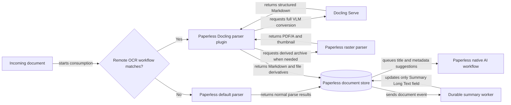

# Paperless Docling Architecture

## Status

Approved high-level design for the first production release.

This document describes the stable architecture and operational contract. Detailed rationale and implementation sequencing live in the [design specification](../superpowers/specs/2026-08-27-paperless-docling-design.md) and subsystem implementation plans.

## Purpose

Paperless Docling improves document ingestion in Paperless-ngx by making Docling's structured Markdown the authoritative extracted content. It also generates concise summaries without delaying or weakening document consumption.

The design replaces two tag-polling prototypes:

- A worker that downloaded tagged Paperless documents, converted them with Docling, and patched content and metadata afterward.
- A worker that polled another tag, summarized Paperless content, and replaced a custom field.

Those prototypes established the value of Docling and summaries, but used tags as an unreliable queue, repeated expensive work after restarts, and updated documents after Paperless had already matched and indexed inferior content.

## Goals

- Use Paperless-ngx workflows to select documents for Docling processing.
- Store Docling Markdown during the original Paperless consumption transaction.
- Enable Docling OCR, layout, table, picture, formula, and code enrichment through a versioned VLM profile.
- Preserve every original input file unchanged.
- Preserve Paperless's automatic searchable archive behavior for scanned documents.
- Delegate title and metadata generation to Paperless's native AI workflow action.
- Generate summaries asynchronously and store the current result in a Paperless Long Text custom field.
- Resume interrupted Docling work and deduplicate repeated summary events.
- Support explicit reprocessing without returning to background scans or tag polling.
- Keep Paperless upgrades practical by distributing the parser through PyPI rather than maintaining a derived Paperless image.

## Non-Goals

- Replacing Paperless's web interface or workflow editor.
- Maintaining a fork of Paperless-ngx.
- Automatically processing every existing document.
- Providing a second document chat or vector database beside Paperless's native AI index.
- Generating or replacing original document files.
- Supporting arbitrary Office and email formats in the first release. Those remain with Paperless's Tika parser.
- Preserving every historical summary inside Paperless. Generation history belongs to the worker job store.

## Architecture

The central design decision is to run Docling as a Paperless parser, not as a post-processing patch. Summarization remains a separate asynchronous service because it is optional enrichment and must not determine whether a document can be archived.

### Paperless Docling Parser Plugin

The parser is a small Python distribution published to PyPI and registered under the `paperless_ngx.parsers` entry-point group. It is installed into the official Paperless container by a root-owned, read-only `/custom-cont-init.d` script.

The plugin:

- Implements the Paperless 3.1 parser protocol.
- Declares `uses_remote_service = True`.
- Scores above the built-in raster parser only for supported input types.
- Is excluded unless Paperless permits remote processing for the document.
- Validates the running Paperless version before handling documents.
- Contains no local Docling models or runtime.
- Treats Docling conversion failure as a Paperless `ParseError`.

The first release supports the formats shared with Paperless's raster parser: PDF, JPEG, PNG, TIFF, GIF, BMP, WebP, and HEIC.

### Docling Serve

Docling Serve performs remote conversion through its asynchronous v1 API. Detailed model credentials and prompts remain in Docling Serve, not in the Paperless container.

The parser requests a named and versioned `paperless-vlm` conversion preset. The preset enables:

- OCR and layout extraction.
- Accurate table structure.
- Markdown output.
- Picture classification and description.
- Formula enrichment.
- Code enrichment.

Docling Serve should allow only the required preset and remote model engine. Arbitrary custom VLM configuration, external plugins, downloads, and the demonstration UI are disabled in production.

### Searchable Archive Generation

Paperless always stores the original input independently from any generated archive. The plugin never changes the original or Paperless's temporary source copy.

When Paperless's archive policy requests a derived archive, the plugin composes the built-in raster parser:

- Scanned PDFs and images receive a separate searchable PDF/A and thumbnail.
- Born-digital PDFs retain their original display file without a redundant archive.
- Docling still supplies the authoritative database content in both cases.

The two derivations intentionally have different responsibilities. OCRmyPDF produces an archival rendering with selectable text; Docling produces structured Markdown for search, matching, AI, and downstream use.

### Native Paperless AI

Paperless 3.1's background Apply AI Suggestions workflow action owns title, tags, correspondent, document type, storage path, and created date. This project does not duplicate that metadata pipeline.

The action runs after content exists and can be configured in Paperless to control which fields are applied, whether existing values may be replaced, and whether missing metadata objects may be created.

### Summary Worker

Paperless Document Added and Document Updated workflows send a small authenticated webhook containing the document ID. Paperless already dispatches workflow webhooks through Celery with bounded request time and retries.

The private summary service:

- Authenticates webhook requests with a dedicated bearer secret.
- Records work durably before returning `202 Accepted`.
- Fetches current effective content through the Paperless API.
- Computes a content hash and summary profile version.
- Deduplicates repeated events and supersedes stale pending work.
- Rechecks effective content immediately before and after writing so concurrent document changes supersede old work and the Summary field converges to current content.
- Uses token-aware Markdown section chunking and map/reduce only when required.
- Produces output in the source document's dominant language.
- Writes only the `Summary` custom field through Paperless's bulk custom-field operation.

The `Summary` field uses Paperless's `longtext` type. Because Paperless's public API does not offer an atomic compare-and-write across document content and custom fields, a summary can be briefly stale when content changes during the final write. Pre-write and post-write hash checks ensure that newer work is enqueued and the field converges to current content. Model, prompt version, content hash, attempts, timing, and errors remain in the worker job store.

## Data Flows

### New Document Consumption

1. Paperless receives a document from the consume directory, API, web interface, or mail.
2. A Consumption Started workflow decides whether to apply Remote OCR.
3. If remote processing is not selected, Paperless uses its normal parser.
4. If selected, Paperless chooses the Docling plugin and passes it a temporary working copy.
5. The plugin creates or resumes a Docling Serve task for the source and conversion profile hash.
6. If Paperless requests an archive, the plugin separately invokes its raster parser.
7. The plugin returns Markdown, optional archive, thumbnail, page count, and metadata accessors.
8. Paperless atomically stores the unchanged original and all successful derived results.
9. Paperless queues native AI suggestions and the summary webhook.
10. Summary completion updates only the Long Text custom field.

### Explicit Reprocessing

The `reprocess ID...` command asks Paperless's own reprocess API to use remote OCR. Paperless remains responsible for task tracking and file/version behavior. A subsequent Document Updated webhook refreshes the summary for changed effective content.

The `resummarize ID...` command enqueues summary work without rerunning Docling. Job administration commands inspect, retry, or purge summary jobs without changing document tags.

No scheduled Paperless scan, trigger tag, or service polling loop discovers work.

## Persistence And Idempotency

### Parser Cache

The parser stores minimal content-addressed state on a dedicated persistent volume. Cache keys include the source checksum and conversion profile version.

An entry may hold:

- Docling task ID and submission time.
- Last observed Docling status.
- Completed Markdown result.
- Profile identity and schema version.

Per-key file locks prevent concurrent duplicate submission. A Paperless retry resumes a known Docling task. If Docling has forgotten a task, the parser performs one controlled resubmission. A successful Paperless transaction removes the cache entry; failures preserve it for retry. Integration tests verify this lifecycle against a downstream Paperless storage failure. Age and total-size limits remove abandoned entries.

### Summary Job Store

The first release uses SQLite in WAL mode and a single worker replica. Summary jobs are identified by document ID, effective content hash, and summary profile version.

Jobs transition through `pending`, `leased`, `retry_wait`, `completed`, `superseded`, `failed`, and `cancelled`. Expired leases recover after process failure. Repeated Document Updated events caused by writing the summary become no-ops because the content hash is unchanged. Explicit resummarization creates a forced generation with its own request identity while retaining normal event deduplication. Manual retry starts a new retry epoch while preserving cumulative attempt history.

The storage interface remains narrow enough to support PostgreSQL later without changing webhook or worker behavior.

## Failure Semantics

Docling and archive generation are required parts of selected consumption. Configuration errors, failed conversions, missing output, deadline expiry, and required archive failures abort the Paperless task. The file remains available for deliberate retry, and Paperless never silently accepts lower-quality content.

Summary generation is optional post-processing. Its failure does not invalidate an archived document. Transient Paperless, model, and network errors use bounded exponential backoff with jitter. Permanent validation failures and exhausted retries remain visible for CLI inspection and manual requeue.

## Security And Privacy

- The parser sends document bytes only to the configured Docling Serve endpoint.
- Docling Serve owns VLM credentials and is restricted to approved presets.
- The summary worker sends extracted content only to the configured OpenAI-compatible endpoint.
- Paperless and webhook credentials use mounted secret files or Compose secrets.
- The summary worker uses a dedicated least-privilege Paperless service account.
- The worker has no Paperless media volume and no host-published port.
- Worker containers run non-root with a read-only root filesystem, dropped capabilities, `no-new-privileges`, and explicit resource limits.
- Logs redact authorization data and never include document content.
- Package installation pins versions and may use a hash-pinned requirements file or private wheel mirror.

## Observability

Parser logs correlate operations by source hash and Docling task ID. Summary logs correlate operations by job and document ID.

The worker exposes:

- `/health/live` for process liveness.
- `/health/ready` for configuration and writable job-store readiness.
- `/metrics` for summary queue depth, oldest pending age, completions, failures, retries, model latency, and token totals.

Paperless remains the source of truth for consumption task status. Parser conversion timing, resumed tasks, resubmissions, and cache cleanup are emitted as structured Paperless logs rather than through a separate plugin metrics server. The summary CLI is the source of detailed post-processing job status.

## Compatibility And Upgrades

Paperless, Docling Serve, and the summary worker use explicit image versions. The parser package declares and checks its supported Paperless release range.

CI tests every supported Paperless and Docling combination and performs a scheduled probe against their latest releases. Updating Paperless does not require building a derived image:

1. Test the candidate official Paperless image with the pinned parser package.
2. Release a compatible parser version if needed.
3. Update the Paperless image tag and recreate the service.

The parser is installed from PyPI at container initialization. Offline or highly controlled deployments can use the same package from a local wheelhouse.

## Testing Strategy

Unit tests cover parser protocol behavior, remote selection, Docling state handling, cache recovery and locking, archive delegation, source immutability, configuration, summary job transitions, webhook authentication, content deduplication, chunking, model output, and Paperless API updates.

Container integration tests use real pinned Paperless and Docling services to prove selected and unselected consumption, VLM preset behavior, separate archive generation, failure behavior, restart recovery, summary idempotency, explicit reprocessing, and metadata preservation. A controllable Docling stub is used only for fault injection that cannot be induced reliably against the real service.

Release smoke tests install the published wheel into the official Paperless image and verify parser discovery before publication is considered complete.

## Alternatives Considered

### Post-Consume Hook Or Worker

Rejected because the document is initially matched and indexed with inferior content, then patched later. It introduces partial states and reindexing races.

### Pre-Consume Script

Rejected because scripts are blocking and can only modify the working file. Docling Markdown cannot be supplied directly as Paperless database content through this hook.

### Paperless Fork

Rejected because maintaining a native Docling engine in a fork would make every Paperless upgrade a merge and release exercise. The parser plugin API provides the required integration without a fork.

### Existing `pgx-docling-parser`

Useful prior art, but its current release does not meet the required Paperless 3.1/Python 3.14 compatibility, workflow-only remote selection, archive generation, resumable conversion, or enrichment profile requirements. This project implements the narrower production contract independently and should upstream generally useful findings where practical.

## Implementation Tracking

Implementation is tracked by the GitHub epic titled `[Epic] Workflow-selected Docling extraction and durable summaries` and its linked child issues.
